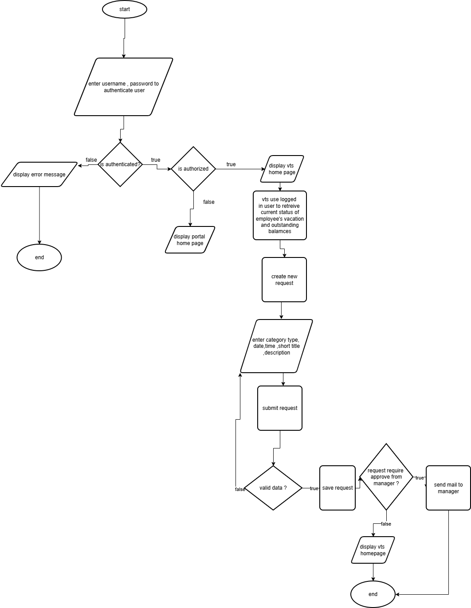

## Vision
The system aims to help employees manage their vacation requests by submit requests  
through an online portal, while allowing managers to approve or reject requests efficiently.

## Function Requirements 
- Employee can log in to the system
- Employee can view current status of employee's vacation time requests and outstanding balances information is displayed for the previous
  6 months and up to 18 months.
- Create new vacation time request.
- Submit new request and validate information.
- Update vacation request info.
- Cancel vacation request.
- Send mail to manager to review requests and approve or reject them.
- Manager can view requests which require approval and can manage own vacation requests.
- Manager can  approve requests or reject them.
- Send notification mail to employee after approve or reject.

## Non Function Requirements 
 - The system must be easy to use.
 - Secure authentication and authorization . 
 - System should be fast.
 - System availability 24/7.

## Constraints 
 - Uses existing hardware and middleware.
 - Is implemented as an extension to the existing internal portal system . 

## Flowchart

 
